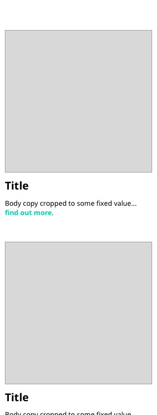

# Conditions List
Your task is to write a very simple app to list given conditions.

1. Write a simple REST API in NodeJS ...
 - Has 1 endpoint `/conditions`
 - Returns the attached "conditions.json" payload 

2. Write a React app that displays the conditions from the API
- Use redux for state management
- Display an initial list with all conditions
- Display an the image, title and snippet as shown in the wireframes. It could be that not all fields exist for each condition, if so the design should handle this gracefully.
- Display a spinner or placeholder component while the API request is ongoing
- Make it look decent. No need for super sophisticated design, but at a minimum, make it somewhat responsive so that it doesn’t look terrible on a mobile phone. Show placeholder images for broken urls.
3. Push the code to a public github repo with a README.md that explains how to run API & Frontend app

## Bonus points

1. Use functional react components with hooks.
2. Use styled-components for styling the app.
3. Write realistic unit/end-to-end tests.
4. Dockerize the app.

## Mobile

 

## Desktop

 

The design should be modular and responsive. A roughed out design that shows intent is better than a compromised pixel perfect design.

Please include a markdown file indicating any decisions / compromises you made during the build.